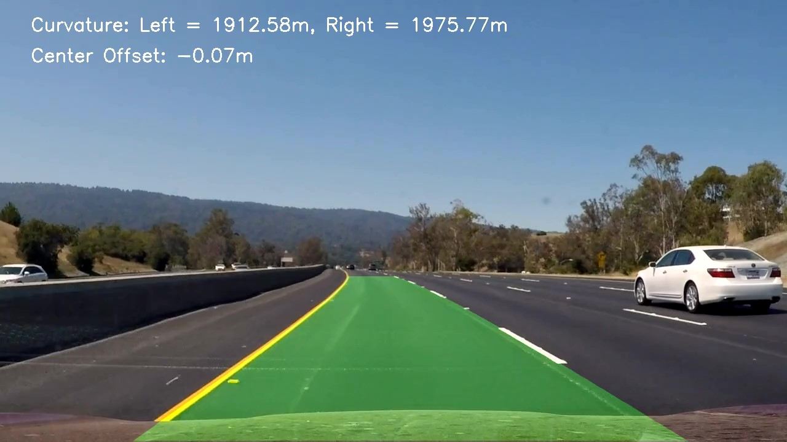

# Advanced_Lane_detection
In this project, not only is the lane detected precisely but also the curvature of both the lanes calculated and the offset of the vehicle center (where the camera is assumed to be placed) from the center of the lane is also calculated.


## Introduction
The Advanced Lane Detection Project is aimed at developing an effective lane detection algorithm capable of accurately detecting lane markings in various driving conditions, including sharp curves and high-contrast lighting. The project utilizes computer vision techniques to process video frames and overlay detected lanes on the original video.

## Getting Started
This project processes input video files, applies image preprocessing techniques, and outputs a video with detected lanes highlighted.

## Files
CameraCalibration.ipynb - is the code for camera calibration using chess board images. Images are available in the folder "Calibration". Calibration data is stored in file calibration_data.npz
DistortionCorrection.py - is the code for correcting the camera distortion using the values obtained from the camera's calibration.
LaneFittingWithWindo.py - is the code for identifying the lane curvature using windowing method.
LaneFittingFromPriorLane.py - the previous method is computationally expensive and so rather than searching for lane in each frame from scratch, this code uses the information of lane's position in the previous frame and searches near that lane first.
ThresholdingAndPerspectiveTransform.py - this code consists of all the preprocessing to be done on each frame image before identifying the lane.
FinalLaneDetection.ipynb - is the final code that combines all the above codes to output the lane detections and position of the car in lane.
project_video.mp4 - is the video used as input to test the functioning of the code.
project_video_output.mp4 - shows the result of the code working.


### Prerequisites
- Python 3.x
- OpenCV
- NumPy
- Matplotlib

## Installation
1. Clone the repository:
   ```bash
   git clone https://github.com/your_username/LaneDetectionProject.git
   cd LaneDetectionProject

## Usage
Place your input video file in the place of the 'project_video.mp4' in the file FinalLaneDetection.ipynb
Run the lane detection algorithm:
View the output video in the same directory

## Algorithm Overview
The lane detection algorithm includes the following key steps:

Undistortion: Correcting lens distortion using camera calibration data.
Thresholding: Applying Sobel and color thresholding to isolate lane markings.
Region of Interest (ROI): Masking to focus on the road area.
Perspective Transform: Warping the image to a bird’s-eye view.
Hough Transform: Detecting lines in the binary image.
Lane Curvature and Offset Calculation: Estimating the curvature of the detected lanes and the vehicle's position within the lane.
Output Video: Overlaying detected lanes on the original video.

## Results
Here are some results from the lane detection algorithm:

